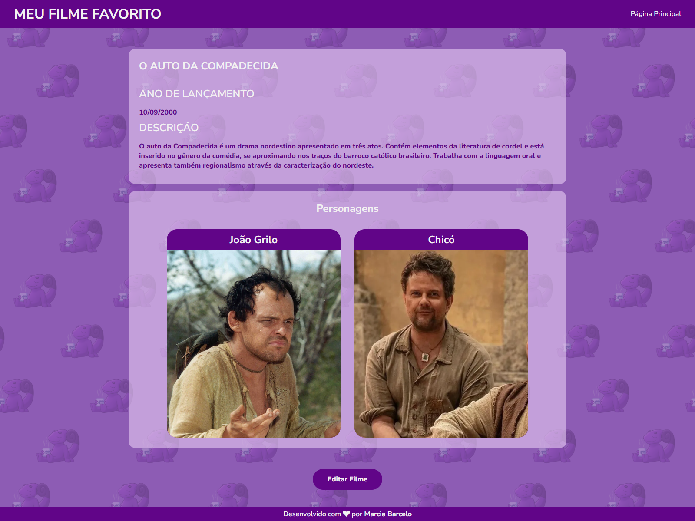

# Projeto Final: Meu Cinema

## Curso
**Curso:** Frontend - Adaptelas  
**Instituição:** Adapti

----

----

## Descrição do Projeto
O projeto "Meu Cinema" foi desenvolvido como parte do curso de frontend oferecido pela Adaptelas. O objetivo deste projeto foi consolidar os conhecimentos adquiridos ao longo do curso, utilizando as tecnologias HTML, CSS e JavaScript para criar uma aplicação web interativa.

## Tecnologias Utilizadas
- **HTML5:** Para estruturar o conteúdo da página.
- **CSS3:** Para estilizar a aplicação e garantir um design responsivo e atraente.
- **JavaScript:** Para adicionar interatividade e manipular o DOM.

## Estrutura do Projeto
O projeto é composto pelas seguintes partes:

### 1. Estrutura HTML
O arquivo HTML é responsável pela marcação básica do projeto, incluindo:
- Um cabeçalho com o título "Meu Filme Favorito".
- Uma seção principal que exibe informações sobre um filme favorito, como o nome, data de lançamento, descrição, e personagens principais.
- Um modal para editar as informações do filme, que é acionado por um botão na interface.

### 2. Estilos CSS
Os estilos do projeto foram definidos em dois arquivos CSS:
- `global.css`: Contém estilos globais aplicados a toda a aplicação.
- `favoriteMovie.css`: Contém estilos específicos para a página "Meu Cinema", incluindo formatação de layout, cores, fontes e responsividade.

### 3. Scripts JavaScript
O arquivo `script.js` é responsável por adicionar interatividade ao projeto, incluindo:
- Manipulação do modal de edição de filme.
- Atualização dinâmica dos dados do filme com base nas entradas do usuário.
- Exibição das imagens dos personagens selecionadas pelo usuário.

## Funcionalidades
- **Visualização de Informações:** O usuário pode visualizar detalhes sobre o filme "O Auto da Compadecida", incluindo data de lançamento, descrição, e personagens principais.
- **Edição de Informações:** Através do modal de edição, o usuário pode alterar o nome do filme, a data de lançamento, a descrição e as imagens dos personagens.
- **Upload de Imagens:** O usuário pode carregar novas imagens para os personagens do filme.

## Como Executar o Projeto
1. Clone o repositório do projeto para sua máquina local.
2. Abra o arquivo `index.html` no seu navegador preferido.
3. Interaja com a página, visualizando e editando as informações do filme.

## Conclusão
Este projeto foi uma excelente oportunidade para aplicar na prática os conceitos aprendidos durante o curso, permitindo o desenvolvimento de uma aplicação web completa e funcional. O projeto "Meu Cinema" demonstra o uso integrado de HTML, CSS e JavaScript para criar uma experiência de usuário rica e interativa.

## Autora
**Nome:** Marcia Barcelo  
**Contato:** [LinkedIn](https://www.linkedin.com/in/mpbarcelo/){:target="_blank"} 

## Agradecimentos
Agradeço à equipe da **Adapti** e ao programa **Adaptelas** pela oportunidade de aprendizado e desenvolvimento profissional.

---

**Visite o site da Adapti:** [Adapti](https://www.adapti.info/){:target="_blank"} 
**Sobre o programa Adaptelas:** [Adaptelas](https://www.instagram.com/adaptiempresajr/){:target="_blank"} 

## Obrigada por visitar esse repositório!
